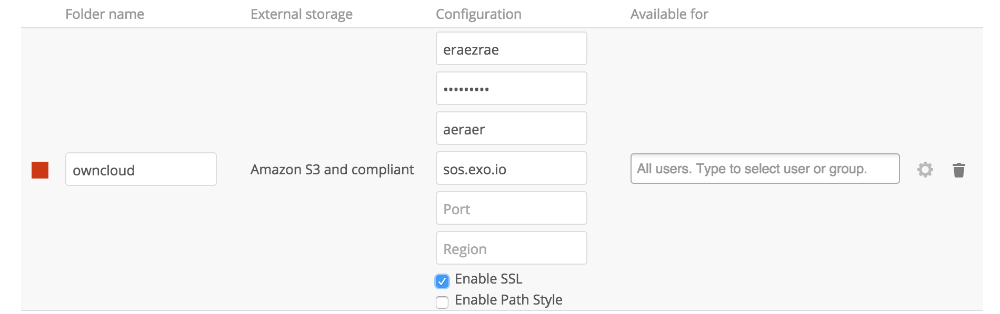

One interesting feature of Owncloud is its ability not to rely 
uniquely on local storage with can present the following limitations:

* Maximum size is limited
* Reliability is of the underlying file-system
* Need to allocate for the total expected storage, which can
have additional costs.

## Plug Object Storage to Owncloud

In order to use External storage, you first have to
activate the appropriate plugin in Owncloud.

* Make sure you have administrator's rights on Owncloud
* Go to Apps in the top left corner of Owncloud
* Select Deactivated 
* Browse for `External storage support` and Activate it

The plugin is now enabled.

* Go to Administration under the dropdown menu on the top right
* A new External storage menu item is present
* Select Amazon S3 compatible
* Input your parameters:
    * Name: this is how your folder will appear in your inbox
    * API and Secret keys: grab them from 
    * Hostname: sos.exo.io
    * Bucket: choose a bucket name (already existing or new - this must be unique amongst all Exoscale users)
    * SSL: check
* A green dot should appear at the beginning of the line indicating that the storage is mounted

