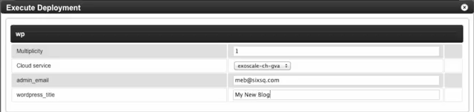

___Originaly published on our blog___

Deploying WordPress using ExoScale and SlipStream requires only a few steps.
[SlipStream](http://sixsq.com/products/slipstream/) is an application deployment platform. Users can deploy multiple VMs and images using services such as Exoscale.

## Usage guide

### Pre-requisites

- SlipStream account (there is a free Try Me option)
- Exoscale account
- Exoscale credit  

### Configure the WordPress deployment on the ExoScale cloud service 

Launch the WordPress "Execute Deployment" dialog in SlipStream by simply clicking on the WordPress icon.

Then choose the max number of VMs to be deployed under "Multiplicity"

Under "Cloud service" choose "exoscale-ch-gva" for the target cloud service. Ensure that under your SlipStream profile you have entered your ExoScale API and Secret Key credentials.
These can be edited by selecting your user profile, then -> exoscale-ch-gva -> Edit

Choose an admin-email and blog title under "admin title" and "wordpress_title"

### Initiate provisioning process

To  deploy WordPress with the above configuration, simply click on the "Run" button in SlipStream.

Once WordPress has been deployed and is available, and "is READY" message appears at the top of your screen, and a large app link will appear at the top right of the screen.

### Start using your fresh instance of Wordpress

Simply click on the app link at the top of the right of your screen to run your WordPress instance.

The WordPress application is deployed with machine-generated maintenance passwords.

Users may deploy multiple instances and VMs depending on resource limits and settings such as Multiplicity.

