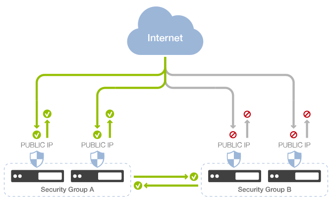
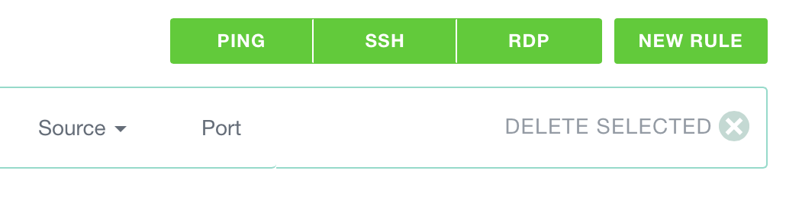

Security Groups provide a modular way to define and compose firewall rules. The
rules are managed at the hypervisor level in order to restrict incoming and
outgoing network traffic.

Security Groups gives you the power of VLANs while keeping a single public IP.
You get the best of both worlds and have never been safer.

## Default firewalling rules

When you create an Instance, you can attribute one or more Security Groups to
it. Firewall rules defined in your Security Groups take precedence over
the default rules, which are:

* **All outgoing traffic is allowed**
* **All incoming traffic is forbidden**

**This means that a new Instance with the *default* and unmodified security
group attributed will be completely inaccessible from outside**.

If you wish to Ping your Instance or to access it via SSH you'll have to define
incoming rules for it.

## About outgoing traffic

By default an unmodified security group without any rule specified allows any
kind of outbound traffic.

However, **as soon as you define an outbound rule, outbound traffic is only
allowed for the defined outbound rules**. Any outgoing traffic not allowed by a
rule will be then blocked. See
[managing outbound security rules](/documentation/compute/outbound-security-rules/)
for more information.

## Security group features

When adding a rule to a security group, you can set the following properties:

* **Traffic type**: INGRESS (incoming) or EGRESS (outgoing).

* **Source type**: this can be a CIDR or a security group. **This allows you to
  define internal rules between Security Groups without the hassle of using IP
  addresses directly. Traffic between your machines will be routed internally
  and not exposed to the internet**.

* **Protocol**: TCP, UDP or ICMP. Special tunneling protocols AH, ESP and GRE
  are also available.
  ([More on that here](https://www.exoscale.ch/syslog/2015/01/06/new-sg-protos/))

* **Start port** and **end port**: this lets you define rules for a specific
  port (set the same port as start and end port) or for a whole range.

Additionally ICMP protocol let you specify Type and Code.

## A simple example
You will probably want to access your Instance via SSH. On a freshly created
machine with no custom SSH configuration, you'll need to set a rule in an
attributed security group allowing TCP ingress on port 22.
You can set it as follows:

* Type: INGRESS
* Protocol: TCP
* Source: 0.0.0.0/0
* Start Port: 22
* End Port: 22

For those most common cases the interface let's you choose between some quick
templates, PING, SSH and RDP.

## Organizing Security Groups

You can add several Security Groups to an Instance during its creation, and add
or remove groups later on in the Instance detail page.

It is important to carefully think about your Security Groups when
setting up any infrastructure.

A common practice is to identify *roles* in your infrastructure.
As an example, an application infrastructure could be composed of:

* application servers
* cache servers
* load balancers
* database servers
* etc, etc.

In this case you could have:

* A "common" security group that defines rules that are common to all
  machines, such as SSH access or internal communication
* One security group per role, defining rules specifically for database
  servers or load balancers.

When setting up a new database server, you would give it the "common" and the
"database" Security Groups.

It is also a good practice to apply this technique even with small
architectures where a single machine can play all different roles. This
way your infrastructure is ready for growth and allows later separation of
services across different machines.

## Add a Security Group to your Instance

Usually you attribute one or more Security Groups during the Instance creation
process. Note that **an Instance must belong to at least one Security Group**.

During the creation process you'll find your primary group already selected.
You can change your primary group from the Security Groups list screen.

Would you need to change an Instance's groups, you may do so on the Instance
detail screen: you can add and remove groups as you like, although you can do
so only when the Instance is stopped.

## Layer 2 filtering
Security Groups provide Layer 2 filtering to keep your instance safe from
different types of spoofing and Man In The Middle attacks. This filtering is
managed automatically so you don’t need to worry about it.

For example the following traffic will be dropped:
* ARP is allowed only when the source MAC matches the instance’s assigned MAC
  address, it is therefore not possible to spoof an instance mac address.
* An instance cannot send ARP responses for the IP address it does not own.
* An instance cannot spoof a DHCP server response.
* If you run Wireshark/tcpdump within your Instance you won’t see your neighbors
  traffic even though your NIC is set to promiscuous mode.

With Security Groups on Exoscale, Layer 2 Ethernet isolation is enforced. This
is commonly achieved using VLANs on a standard architecture.

## Layer 3 (and 4) filtering
Security Groups provide Layer 3 filtering, which can be managed trough
our console or API:
* Ingress and Egress IP traffic can filtered by Protocol / destination / destination port.
* By default all Ingress is denied and Egress is fully allowed until you create
  a first rule. As soon as you create an egress rule, only the matching traffic
  will be allowed
* Egress filtering is preventing any broadcast / multicast traffic to leave your
  instance.

Layer 3 and 4 filtering typically take for source parameters:
* An IP address in the form of a single IP or network.
  For example: 8.8.8.8/32 or 0.0.0.0/0 are valid entries
* Or a Security Group; this can be a self declaration for allowing traffic from
  machines belonging to the same group or another Security Group

## BUM traffic
[BUM](http://etherealmind.com/network-dictionary-bum/) is dropped by egress
rule. This is an expected behavior as we don’t want anyone to receive this type
of traffic, which may also leak sensitive information. Therefore any application
relying on Broadcast, Unknown unicast and Multicast traffic type will not work.

## More Security Groups resources

We just scratched the surface about Security Groups. You can find more tutorials
and resources about them:

* How to [modify Security Groups attributed to an Instance](https://www.exoscale.ch/syslog/2015/06/22/changing-security-groups/) (from our blog)

* Another simple example on [how to set up PING](/documentation/compute/security-groups-recipes/), and understanding the ICMP protocol

* A detailed explanation about [outbound traffic rules](/documentation/compute/outbound-security-rules/)

* A great example on how to use Security Groups for a more complex setup, combining them to obtain [network isolation](https://www.exoscale.ch/syslog/2015/06/01/security-group-isolation/) (from our blog)
