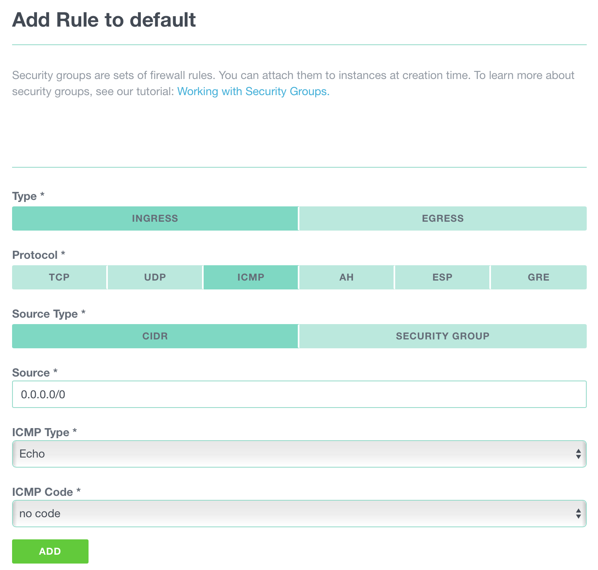
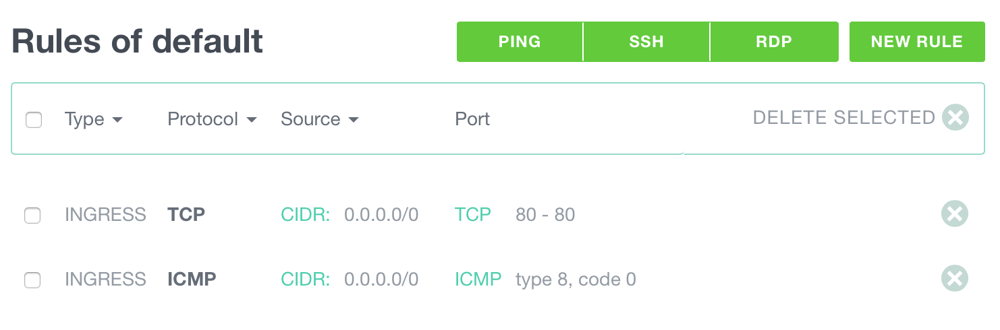
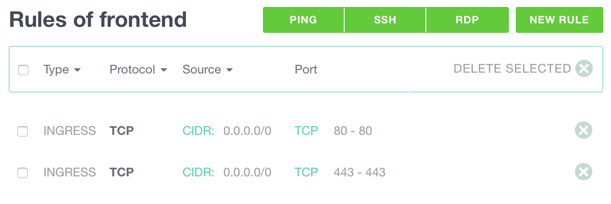
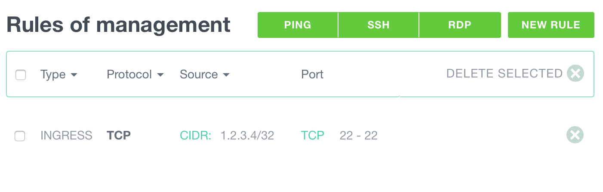

## Understanding ICMP

On top of TCP and UDP traffic, the Internet Protocol (IP) can also carry
ICMP messages.

While all ICMP requests are closed by default on your Instances, it is easy
to add ECHO REPLY ICMP traffic rule to your security group to be able
to ping your Instance.
With Ping activated to an Instance, it is then easier to enable it in your
preferred monitoring tool or service.

## Adding ping to your Instances

To add ingress ping connectivity to your Instance follow this procedure:

* **Locate the security group**: navigate to the Instance list and choose
  the security group enabled on your Instance on which you want to add ping
  traffic. Please note that all Instances belonging attached to this security
  group will gain ping access too.

* **Add a rule**: in the selected Security group add a INGRESS rule, restrict
  the source IP or Network range, then select the ICMP protocol.

* **Echo**: Select the type ECHO (type 8) and code NO CODE

* **Save**: Save your rule by clicking on Add and allow a few moments for
  the rule to propagate on the Exoscale cloud

The resulting rules appears like this:

## Reminder

* **Outbound traffic**: By default all outbound traffic is
  permitted, however as soon as you define an outbound rule, outbound traffic
  is only allowed for the defined outbound rules. See [managing outbound
  security rules](/documentation/compute/outbound-security-rules/)
  for more information.

* **Allow Outbound Reply**: to allow outbound reply if the outbound traffic
  is restricted, add an outbound rule with ICMP Type ECHO REPLY (type 0) and
  code NO CODE.

## Allowing HTTP and HTTPS access to your machine

When you deploy an application on your server, you might want it accessible via
a browser, either via HTTP or HTTPS. To do that, you need **ingress** rules in a security
group to allow communication on port 80 (HTTP) and 443 (HTTPS).

* Create a new security group: **frontend**
* Add a first rule: ingress, tcp, CIDR 0.0.0.0/0, port 80-80
* Add another rule: ingress, tcp, CIDR 0.0.0.0/0, port 443-443

Now the Instances using this Security Group will allow traffic from any IP
(CIDR 0.0.0.0/0) on port 80 and 443.

Add this Security Group to the Instance that will be accessed via HTTP and HTTPS.

If your Instance only has this Security Group, you won't be able to access it
via SSH.

## Allowing SSH access to your machine

Once an Instance is deployed, if you want to manage it via SSH, you should allow
incoming traffic on port 22. [It's very easy to create a rule to do so.](/documentation/compute/security-groups/#A_simple_example)

However, we recommend that you create a Security Group dedicated to the
"management" of your machines. Adding some granularity in your Security Group
will make things easier when you have more complex setups.

* Create a new Security Group: **management**
* Add a new rule: ingress, tcp, port 22
* Change the CIDR for this rule to your IP range. **You don't want to allow every
  IP to be able to connect to your machine via SSH.**

Add this Security Group to the Instance(s) you want to manage via SSH.
