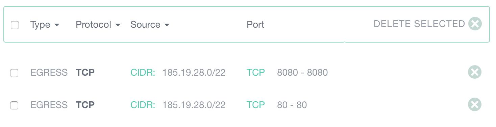

By default and without any rule specified, all outbound traffic is authorized.
However, as soon as you add your first outbound rule, only the traffic
explicitly declared in outbound rules is allowed.

If you need to restrict outbound traffic, please note that the following TCP
rules must be added:

* Destination subnet `185.19.28.0/22`, start port: 80, end port: 80.
* Destination subnet `185.19.28.0/22`, start port: 8080, end port: 8080.

The screenshot below shows a properly configured security group:

These 2 rules are required for:

* Setting the root (Linux) or administrator (Windows) account password on
  first boot.
* Deploying your ssh key (Linux).
