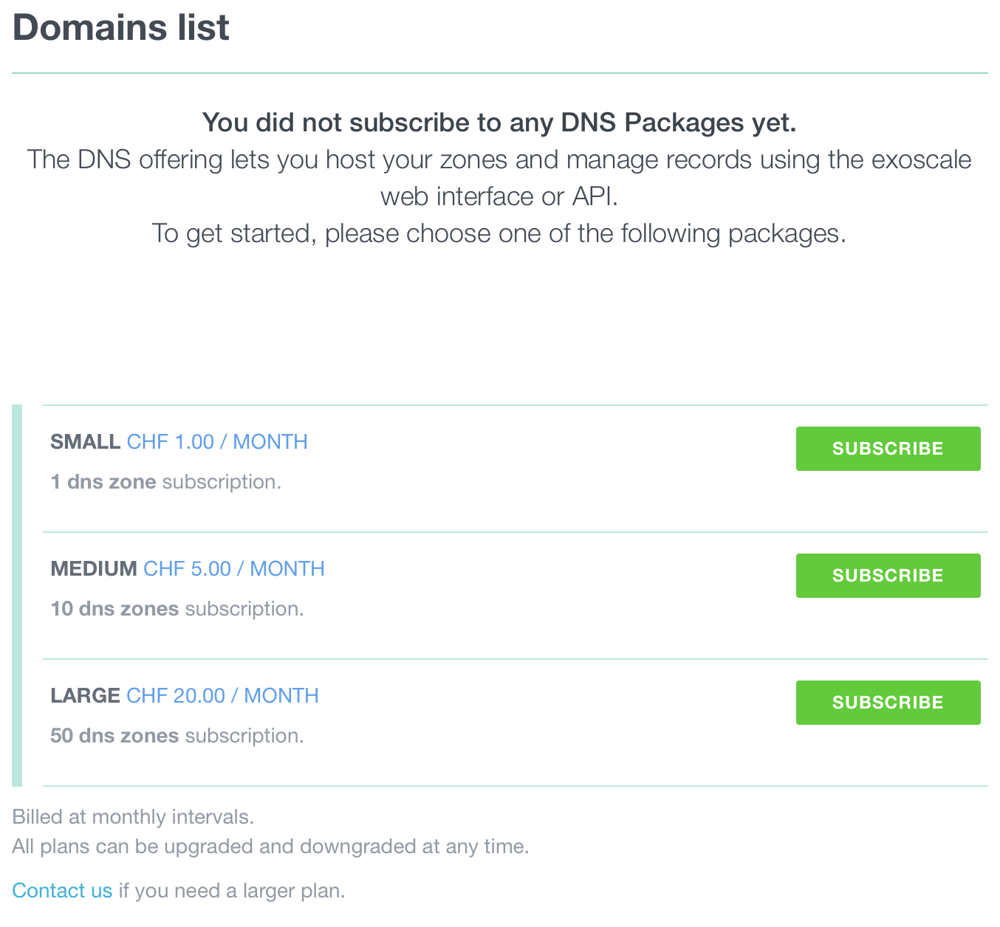
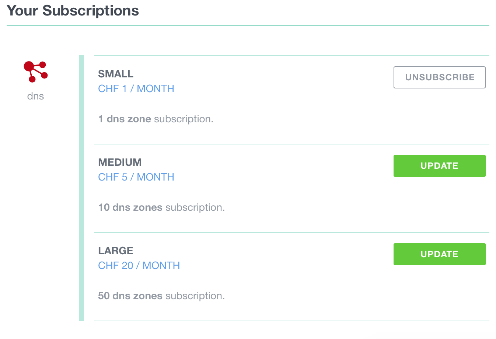

Our integrated DNS service, built in cooperation with DNSimple provides a
simple way to host your Zones.

## Subscribing to the service

If you wish to subscribe to Exoscale DNS you only need to select the
Zone bundle which suits you best from within our portal. The up-to-date list of
plans is available at https://exoscale.ch/add-on/dns

On the menu to the left, click on the `DNS` icon. You are presented with a list
of Zone bundles, depending on the number of DNS Zones you want to manage.
Choose the Zone bundle of your liking. You can upgrade your subscription at
any time.

## Registering domains

Exoscale provides no way to register domains and assumes you already have
bought domains from an existing registrar. Once you have configured your Zone
- either through our API or interface - you'll need to adjust the
NS servers for your Zone with your registrar.

## DNS configuration

You have two ways to configure your Zone:

* [using the web interface](/documentation/dns/configuration-recipes)
* [using the API](/documentation/dns/api-recipes)

## Subscription upgrade and downgrade

To upgrade or downgrade your DNS subscription, go to your Account.
Click on the `Funds and Subscriptions` sub-menu and choose your
new subscription.

