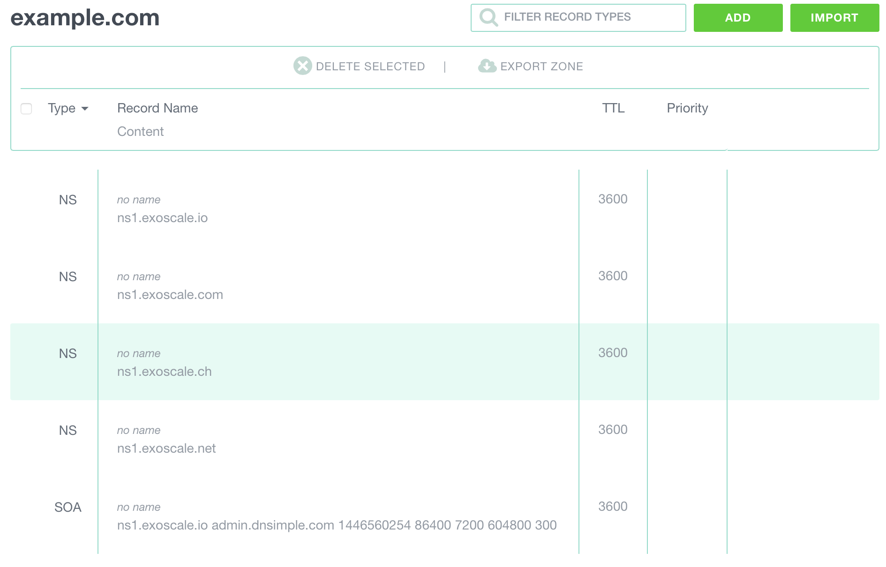

The web interface for our DNS service is intuitive and lets you manage all
aspects of your DNS zone.

We assume that you've already chosen a zone bundle. If that's not the case,
[here's how to select one.](/documentation/dns/quick-start)

## Configuring a zone with the interface
You can now add a domain to the list: enter your domain name in the
`Add a domain` form and click `Add`

Your subscription might turn to red, showing that you cannot manage more
domains. If that's the case and you need to add more domains, [upgrade
your subscription to a larger plan](/documentation/dns/quick-start).

Your domain appears in the list of managed domains.  
Click on the domain name to display its records.

## Configuring the domain name at the registrar
Before going any further with the zone configuration, check the domain name
configuration with your registrar: the name servers should be set to the NS records showing on the Exoscale interface.
If this is not set, all the records you're setting up in the Exoscale
interface will not be used.

## Configuring a machine record
* Click on the `ADD` button on the top right of the window
* Select the record type `A`
* Give it a name
* Enter the IP address of the server.  
  *If you don't have a server, why not
  [start an Instance](/documentation/compute/quick-start)?*
* Change the TTL value if needed.
* Click on `ADD THE RECORD`

A message informs you that the record has been added. You can continue adding records to the zone.

## Configuring a alias record
* Select the record type `CNAME`
* Give it a name
* Enter the targeted subdomain
* Change the TTL value if needed.
* Click on `ADD THE RECORD`

## Configuring a Mail Exchange record
* Select the record type `MX`
* Give it a name
* Enter the mail server host
* Enter the priority
* Change the TTL value if needed.
* Click on `ADD THE RECORD`

## Configure my domain to point to an IP
In some cases, you need a domain to point to an IP.
For instance, you want the domain `example.com` to point to 10.0.13.37 with an
A record.

* Click on the `ADD` button on the top right of the window
* Select the record type `A`
* **Leave the name blank.**
* Enter the IP address of the server.
* Change the TTL value if needed.
* Click on `ADD THE RECORD`
