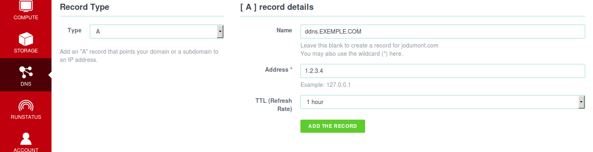

# Make your own DynDNS with Exoscale

## Prerequisite

1. Having a DNS Zone
2. Created the subdomain you want to point to your dynamic IP

##1. Throught the Exoscale portal

1. **[Subscribe your domain](https://portal.exoscale.ch/dns)**

2. **Point your domain to your new ns**
	3. ns1.exoscale.io
	4. ns1.exoscale.com
	5. ns1.exoscale.ch
	6. ns1.exoscale.net

3. **Add A Record under your domain**

	    such as into this exemple : **ddns**.EXEMPLE.COM
	    ddns is a A Record under the EXEMPLE.COM domain
	    with a TTL of 1hour
	    which means *every hour* it could be updated.

##2. On your Host with a Dynamic IP

1. **Make script file like /root/bin/update_exodns.sh**
cut and past this inside this file
*find your API Key and Secret [here](https://portal.exoscale.ch/account/profile/api)*

		#!/bin/bash
		LOGIN="___PUT YOUR API Key ___"
		TOKEN="___PUT YOUR Secret Key___"
		DOMAIN_NAME="___PUT YOUR DOMAIN NAME___"
		IP=`dig +short myip.opendns.com @resolver1.opendns.com`
		DOMAIN_ID="___PUT YOUR RECORD ID___"
		RECORD_NAME="___PUT YOUR SUBDOMAIN TO UPDATE (like ddns in this exemple)___"
		RECORD_TYPE="A"

		curl -H "Accept: application/json" \
             -H "Content-Type: application/json" \
		     -H "X-DNS-Token: $LOGIN:$TOKEN" \
    		 -X "PUT" \
		     -i "https://api.exoscale.ch/dns/v1/domains/$DOMAIN_NAME/records/$DOMAIN_ID" \
		     -d "{\"record\":{\"content\":\"$IP\"}}"

2. Make this script executable

		$ chmod 700 /root/bin/update_exodns.sh

3. Don't forget the **CRON** (as root)

		$ crontab -e

		*** ADD THIS LINE ***
        @hourly /root/bin/update_exodns.sh > /dev/null 2>&1

## How to Find your DOMAIN ID
1. **Make script file like /root/bin/getid_exodns.sh**  
cut and past this inside this file  

		#!/bin/bash
		#The best I could it's this ugly script
		LOGIN="___PUT YOUR API Key ___"
		TOKEN="___PUT YOUR Secret Key___"
		DOMAIN_NAME="___PUT YOUR DOMAIN NAME___"

		curl -H "Accept: application/json" \
	             -H "Content-Type: application/json" \
		     -H "X-DNS-Token: $LOGIN:$TOKEN" \
    		     -i "https://api.exoscale.ch/dns/v1/domains/$DOMAIN_NAME/records" \
    		     	| awk -F',"' '{print $2}'

2. Make this script executable

		$ chmod 700 /root/bin/getid_exodns.sh

3. Run it

		$ /root/bin/getid_exodns.sh

inspired by : [Bash Script for DNSimple](https://developer.dnsimple.com/ddns/)

which could be probably adapted for : Ruby, Node.js, GOlang & Windows. [see more](https://developer.dnsimple.com/tools/).
