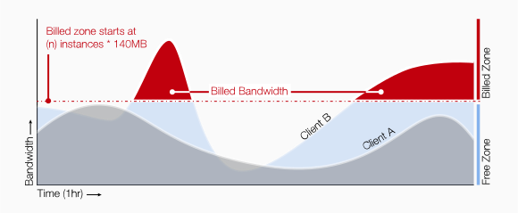

Each resource, unless noted otherwise, is billed by the exact time or unit of
metering you consume.
Your credit status is updated every hour.
Most resources are metered on exact consumption usage or up to the minute.

## Pre-paid billing
Our services are available after your account has been credited with some funds.
We accept various secured payment methods, major Credit Cards, Postfinance
cards and PayPal.
The amount credited to your account cannot be reimbursed.

## Post-Paid billing
This service is available upon requests and is activated after a case by case
examination on simple demand to our service desk:
open a ticket from your organization context and drop us a line asking to go
postpaid.

You will receive monthly invoices you'll be able to pay either via credit-card
or PayPal as usual, but also through wire transfer. Post-paid Billing is also
supported in EUR and USD currencies.

## Compute
Exoscale Compute pricing is split between Instance pricing and Disk pricing.
This lets you mix and match cpu, ram and disk profiles to get the best out of
your buck.

We don't charge you for:
* Inbound Traffic
* Support for data portability or reversibility
* Web and email support

**Billing of powered off machines**

Powered off machines will only be charged for resources still in use.
Therefore, the volume attached to your instance will still be charged. During
trial period, computing resources are charged even when the machines are
stopped. This behavior is converted to the default behavior on first payment.

**Billing of network usage**

The bandwidth is billed hourly and takes the number of machines running during
the last one-hour period.

there are 140MB of output bandwidth for free per machine. If a machine doesn’t
use its free tier, it is reported on other running machines of the same
organization. So, with 5 machines running during the last hour, there are
700MB of free output bandwidth. The exceeding bandwidth is billed.

**When the credit runs out**

When your credit goes below 15CHF, you receive an email notification. If you
don't add credit and your credit runs out, you machines will be stopped and your
account will be `suspended`. You won't be able to start your machines until you
add credit.
While your account is `suspended`, negative credit will add up as you are
charged for the volume attached to your Instance.

If you then choose to add credit, you need to add enough to be in positive in
order to be able to start back your instance.

If you choose to not add credit, all your instances will be removed after
several weeks and reminders.

## Storage
Exoscale Storage pricing is simple:

* 0.0540 CHF per GB stored
* 0.0826 CHF per GB of networking out

There is no other charge.

So if you store a 1GB file it will only cost you 0.0540 CHF. Retrieving the file
will cost you 0.0826 CHF.

## DNS
Exoscale DNS is paid with on of these three subscriptions:

* **Small**: 1CHF/month for 1 zone
* **Medium**: 5CHF/month for 10 zones
* **Large**: 20CHF/month for 50 zones

You are billed at monthly intervals.
You can upgrade and downgrade your subscription at any time, and you will be
charged pro-rata to your usage.

As an example, if you subscribe to a DNS plan for 10 days and then
unsubscribe, you will be charged 10/30th of the price.

## Apps
Exoscale Apps are charged by the hour, per memory container.
One memory container is 128MB.
Memory hours (MeH) are the unit used to measure consumed computing resources.

So 1 hour of 1 memory container is charged 0.0108 CHF

Memory container hours are charged by the second, and your billing status is
updated every hour.
