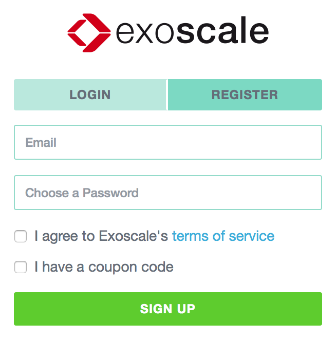
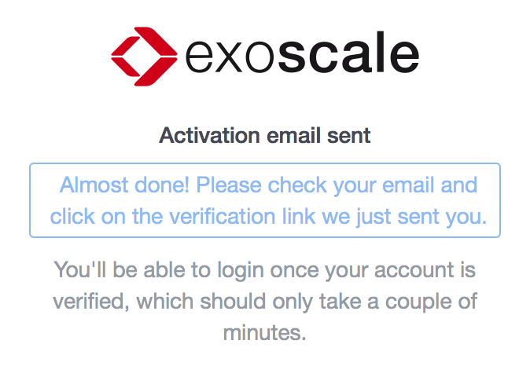
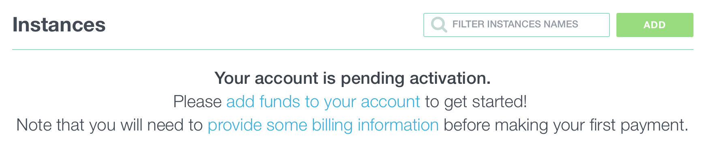
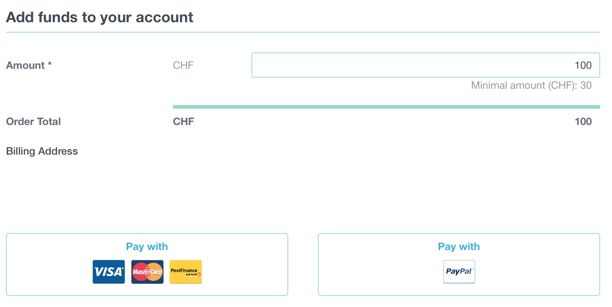
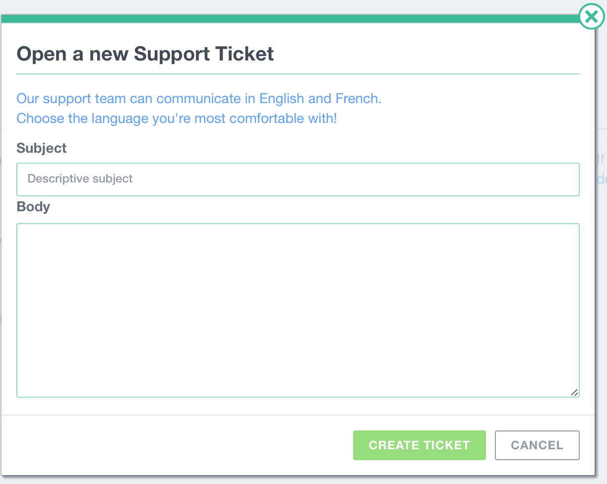

To start using Exoscale's services you will need the following:

* An [account](https://portal.exoscale.ch/register)
* Some credit on the account

Then you will be able to start an Instance of your favorite OS, deploy an
Application, store some data on our Simple Object Storage and even manage your
DNS settings.

## Minimum credit
In order to start an Instance, your account needs to have enough
credit to run the Instance for 3 days. For example, a "Tiny" Linux instance
requires a minimum credit of 3 CHF to start.

You will receive an email notification when your Instances usage are decreasing
your credit under 15 CHF.

## Trial credit
When there is enough capacity on our Compute platform, a Trial credit is
offered to new accounts.

## Instance limit
A limit of 20 Instances is in place. If you need to run more than 20 Instances,
please contact our Help Desk.
If you're using Trial credit, the limit is reduced to 2 Instances.

## API Keys
API Keys (and API Endpoints) allow you to access all services on the Exoscale
platform programmatically.

Your API Key and Secret Key are generated automatically. You can renew your keys:
from the `ACCOUNT` menu, choose `PROFILE` and go to the `API Keys` tab. Then
click on the `RENEW API KEYS` button.

## Account registration
To register your account, go to our
[account registration page](https://portal.exoscale.ch/register).

## Account activation
You should receive an email asking you to activate your account.

If you registered with Trial credit, a phone validation is performed. You will
need to enter your phone number in your profile details, and an automatic phone
call will give you a validation code.

To finish activating it, you need to add some credit.

## Menu
On the left side of your browser window, you'll find the main menu bar, where
you can find a link to our products, to your account and to our support.
Clicking on one of the icons will display a sub-menu to access the different
sections:

1. [Compute](/documentation/compute/quick-start): manage your Instances, Security Groups, SSH Keys, ...
2. [Storage](/documentation/storage/quick-start): manage your Buckets and your Objects
3. [Apps](/documentation/apps/quick-start): manage your Apps and their deployments
4. [DNS](/documentation/dns/quick-start): manage your Domains and their Records

## Account Menu
From this menu, you can update your profile, setup
[2-factor authentication](/documentation/platform/two-factor-authentication), view and
renew your API keys, and change your account preferences.

In the sub-menu, you can access your credit and subscriptions, check your
[billing information](/documentation/platform/services-billing), your invoices and
your [organizations](/documentation/platform/organizations)

## Support Menu
This is where you view your support tickets. You can also open a new support ticket.

